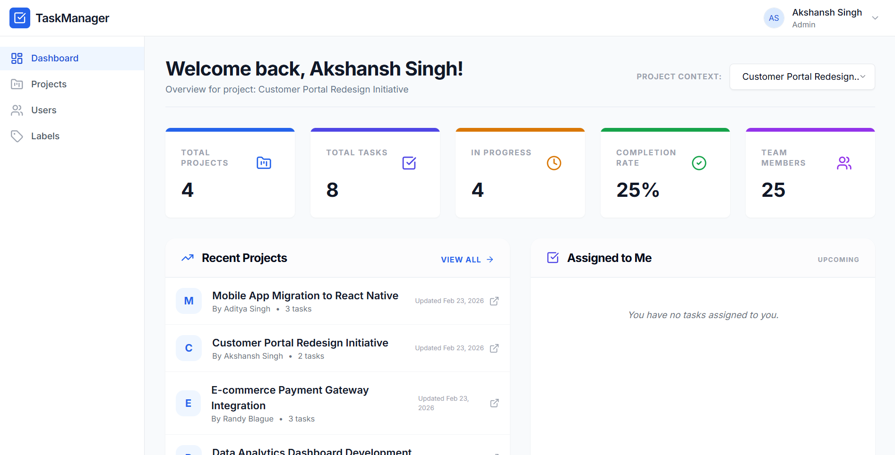
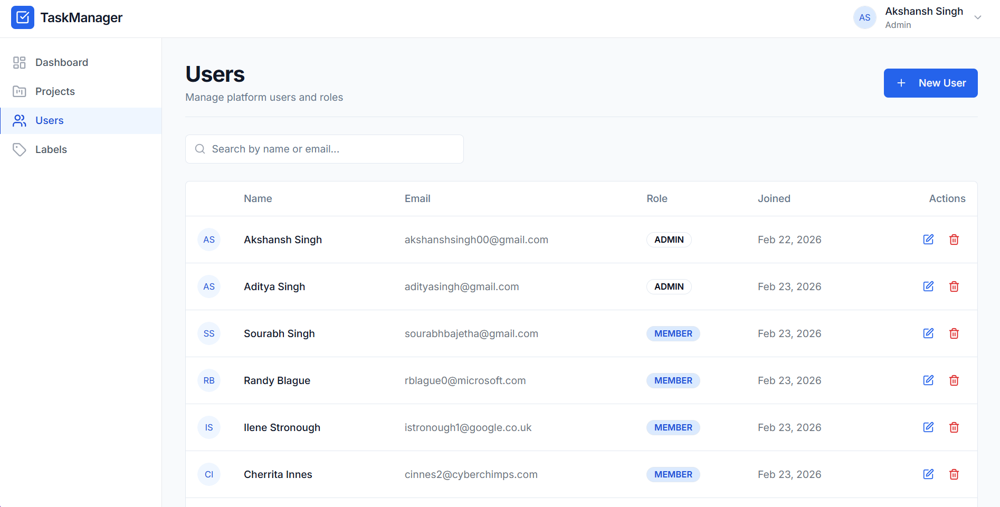
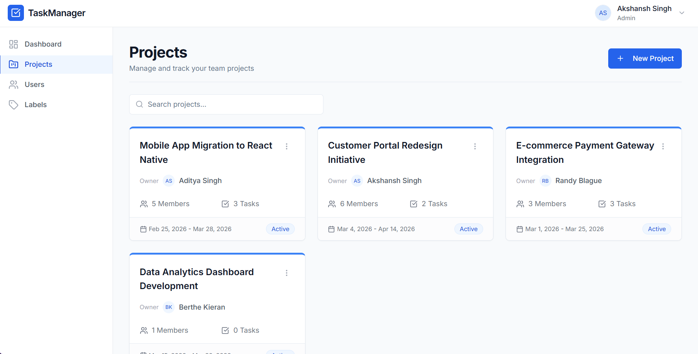
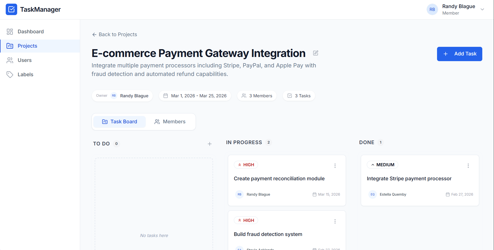
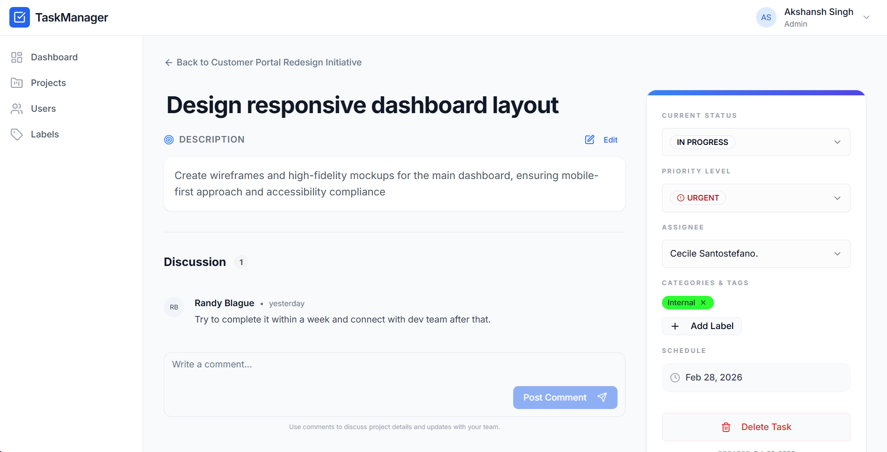

# Task Management & Collaboration Platform

[](https://nextjs.org/)
[](https://reactjs.org/)
[](https://tailwindcss.com/)
[](https://tanstack.com/query/latest)
[](https://ui.shadcn.com/)

A modern, high-performance **Task Management & Collaboration Platform** built with **Next.js 15**, **shadcn/ui**, and **TanStack Query**. Designed for teams to streamline project workflows, manage tasks effectively, and maintain clear communication.



## ✨ Key Features

- **Dynamic Dashboard**: Comprehensive overview of project statistics, recent activities, and tasks assigned to you.
- **Project Management**: Create and manage projects with ease. Track progress and keep your team organized.
- **Task Tracking**: Robust task management system with support for priorities (Urgent, High, Medium, Low), statuses, and assignments.
- **Team Collaboration**:
  - Real-time user search and selection.
  - Role-based user management.
  - Discussion threads with nested comments on tasks.
- **Flexible Labeling**: Organize tasks and projects with customizable labels.
- **Responsive UI**: A sleek, dark-mode-ready interface built with Tailwind CSS and Framer Motion-inspired micro-animations.

---

## 🛠️ Tech Stack

- **Framework**: [Next.js 15](https://nextjs.org/) (App Router)
- **State Management**: [TanStack Query v5](https://tanstack.com/query/latest) (React Query)
- **Styling**: [Tailwind CSS](https://tailwindcss.com/)
- **UI Components**: [shadcn/ui](https://ui.shadcn.com/) (Radix UI)
- **Icons**: [Lucide React](https://lucide.dev/)
- **HTTP Client**: [Axios](https://axios-http.com/)

---

## 🚀 Getting Started

### Prerequisites

- **Node.js**: v18.17.0 or later
- **npm**: v9 or later

### Installation

1. **Clone the repository**:

   ```bash
   git clone https://github.com/Akshansh029/Task-Management-Platform-Frontend.git
   cd Task-Management-Platform-Frontend
   ```

2. **Install dependencies**:

   ```bash
   npm install
   ```

3. **Environment Setup**:
   Create a `.env.local` file in the root directory and add your backend API URL:

   ```env
   NEXT_PUBLIC_API_BASE_URL=https://your-api-url.com/api
   ```

4. **Run the development server**:
   ```bash
   npm run dev
   ```
   Open [http://localhost:3000](http://localhost:3000) in your browser to see the application.

---

## 📁 Project Structure

```text
src/
├── app/            # Next.js App Router (Pages and Layouts)
├── components/     # UI Components
│   ├── ui/         # Base shadcn components
│   ├── shared/     # Reusable high-level components
│   └── [module]/   # Feature-specific components (projects, tasks, etc.)
├── lib/            # Utilities and core logic
│   ├── api/        # Axios API clients
│   ├── hooks/      # Custom React Query hooks
│   └── utils.js    # Helper functions
├── providers/      # Context providers
└── styles/         # Global styles
```

---

## 📐 Data Architecture

The application is designed around a clean separation of concerns:

- **API Layer**: Centralized axios client with interceptors for consistent request handling.
- **Hook Layer**: Custom hooks using TanStack Query for efficient data fetching, caching, and optimistic updates.
- **View Layer**: Modular components using shadcn/ui for consistent and premium look-and-feel.

---

## 🎨 Preview

- Users

  

- Projects

  

- Project details

  

- Tasks details

  

---

## 🔗 Backend Repository

The backend for this project is available at:
[Task Management Platform Backend](https://github.com/Akshansh029/task-management-platform-backend)

## 📌 Todo

- Activity logs / audit trail
- Task search and filtering
- Email notifications

## 🤝 Contributing

Contributions are welcome! Please feel free to submit a Pull Request.

1. Fork the Project
2. Create your Feature Branch (`git checkout -b feature/AmazingFeature`)
3. Commit your Changes (`git commit -m 'Add some AmazingFeature'`)
4. Push to the Branch (`git checkout -b feature/AmazingFeature`)
5. Open a Pull Request
